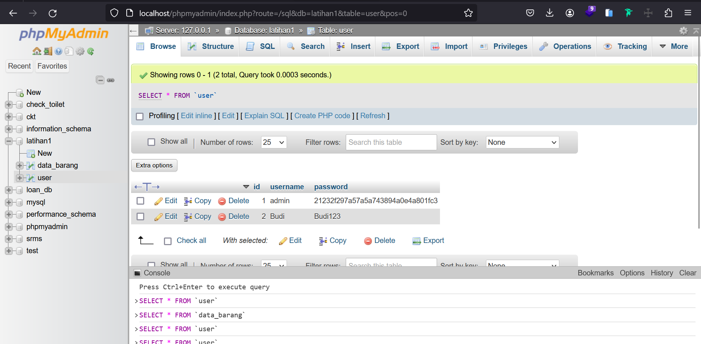
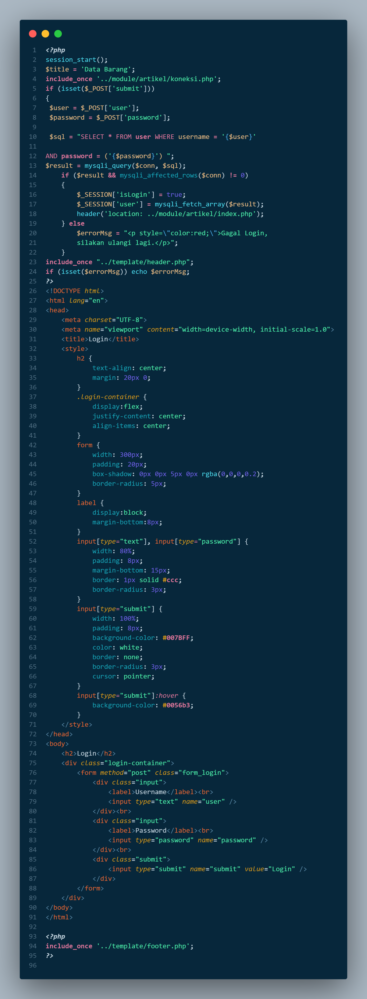
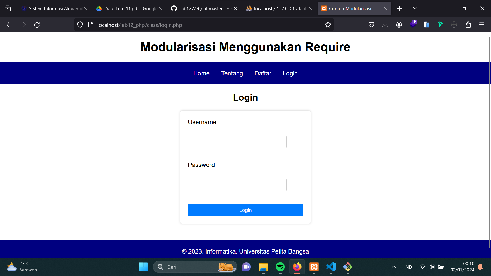

# Praktikum-12
## Studi Kasus : Membuat Login Form
- Saya menggunakan project praktikum-11 dengan menambahkan fitur login 
### 1. Membuat DDL : Table User
Saya membuat user baru bernama Budi unttuk melakukan Login 
```
CREATE TABLE `user`(
`id` INT NOT NULL AUTO_INCREMENT,
`username` VARCHAR(50),
`password` VARCHAR(50),
PRIMARY KEY (`id`),
UNIQUE INDEX `UNIQUE` (`username`)
) ENGINE=MYISAM;
INSERT INTO `user` (`username`, `password`) VALUES ('admin', md5('admin'));
```

### Membuat File : login_session.php
```
<?php
session_start();
if (!isset($_SESSION['isLogin']))
header('location: login.php');
?>
```
### Membuat File : login.php
- Saya juga menambahkan style css untuk tampilan halaman Loginnya <br>
- Sehingga ketika Login langsung menuju ke halaman Daftar


